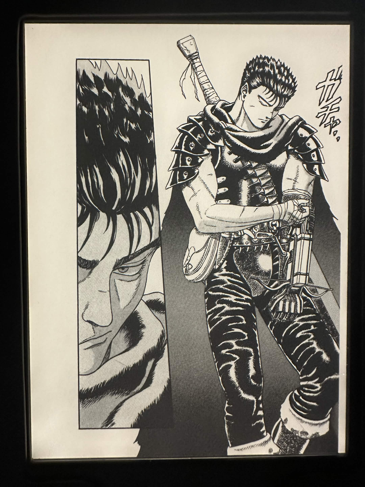
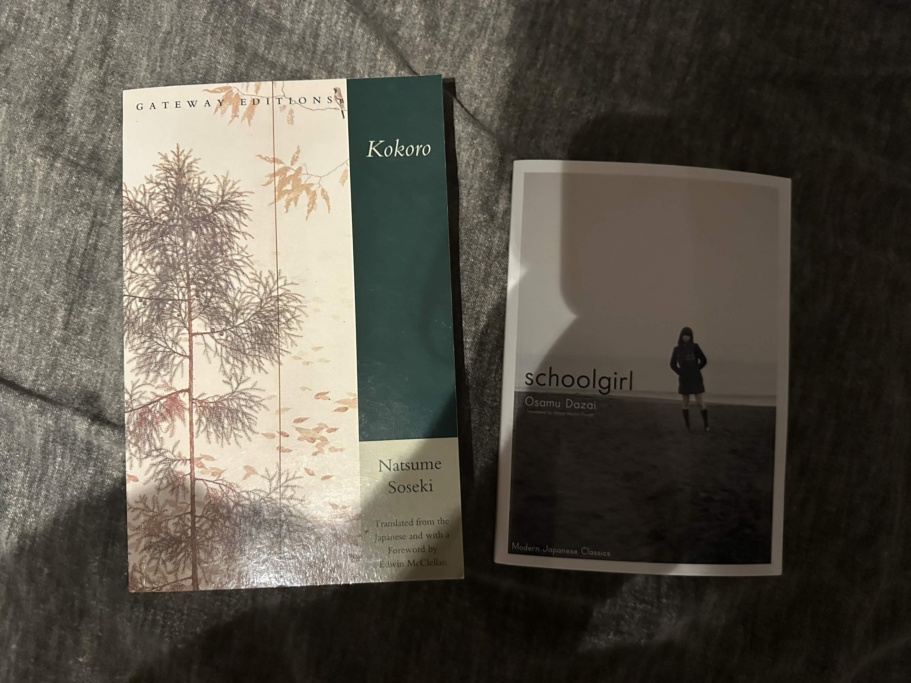

# Hello

## Introduction 

Am I ever going to use this? Probably not, but I've been procrastinating it forever so I thought why not finally set up a "blog". In reality, it's just going to be yapping about whatever my current hyperfixation is; I don't really plan to bother with formality, so treat this like my own silly twitter feed.

To give myself a reason to bother updating this frequently, I'll actually try to write about something right now, that being whatever shit is going on right now...

## Current Interests
### Reading
I've been getting back into reading a lot more which has been very nice; a while ago I had the same phase and really disliked how I just stopped the hobby alogether after about 2 months, so I was really determined to pick it up again, and well... it worked. One of the biggest factors was my [Kobo Clara BW](https://ereader.kobo.com/en-au/products/kobo-clara-bw) eReader which I'll honestly probably make a whole post about. I can't get enough of it. I was initially torn with a feeling of indecision at having to 'choose' between reading physically or digitally, when I realised i don't even have to. It sounds really silly but I do have quite an all-or-nothing mentality when it comes to aspects of my life, however, I've been enjoying the hobby a lot more since I stopped caring about the details and instead focused on the actual task itself.

*Guts' aura farming on my [eReader](https://ereader.kobo.com/en-au/products/kobo-clara-bw)*

As of the time of this post I'm currently reading:
- [Ascendance of a Bookworm](https://anilist.co/manga/87383/Ascendance-of-a-Bookworm-Part-1/) v03 (LN)
- [Berserk](https://anilist.co/manga/30002/Berserk/)
- [Kokoro](https://www.goodreads.com/en/book/show/762476.Kokoro) by Natsume Sōseki

I've really been enjoying these, specifically [Kokoro](https://www.goodreads.com/en/book/show/762476.Kokoro) for which I have the physical copy (it cost me an arm and a leg xd). [Berserk](https://anilist.co/manga/30002/Berserk/) too has been honestly phenomenal; for some reason, despite it being the nr1 manga ever rated I've never really assumed it could be ***that*** good, but the artwork is genuinely fucking phenomenal and the actual plot itself is not lacking in the slightest.

### Music
My music update as of now is really nothing special; I've just been listening to [lexycat](https://open.spotify.com/artist/4h2w55mRM0SkL9c0fu3qAC) lol, specifically [heartstrings](https://open.spotify.com/album/46TUfbPq2XsRRtdRy2Jy01) (insanely good album) & [crystal forest](https://open.spotify.com/album/4lLsYPwlAFujyvSCNGpPqK).
